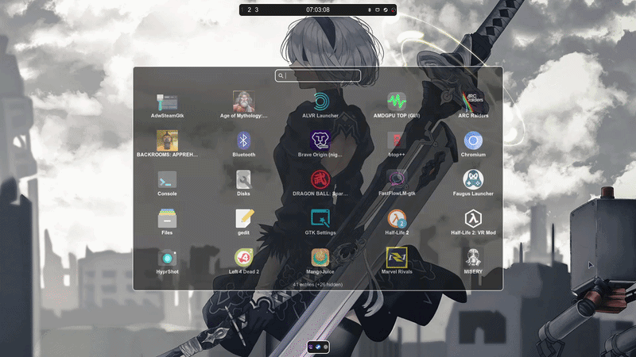

# Ryzenadj-gtk

GTK4 frontend for ryzenadj. Just lets you change power limits, currents, temps, and curve optimizer without living in the terminal.


Powered by [RyzenAdj](https://github.com/flygoat/ryzenadj) ❤️



## What it does

- Dashboard showing current power, current, temps, and clock speeds
- Curve optimizer with all-core, iGPU, and per-core sliders (-30 to +30)
- Power limits (STAPM, fast PPT, slow PPT, APU PPT)
- Current limits (TDC and EDC for CPU and SoC)
- Temperature limits and skin temp controls
- iGPU clock limits (if ryzenadj can't change it, the app falls back to writing directly to the AMDGPU driver via sysfs)
- SoC clock and low-level options
- Save custom profiles and switch between them easily
- Auto switch profiles when you plug or unplug the charger
- Works after sleep (applies settings again automatically when the machine wakes up)
- Persistence Guard: keeps applying settings in the background so the system firmware doesn't reset them behind your back
- Warns you if Secure Boot or kernel lockdown is active (since that blocks ryzenadj from writing to hardware)
- Enthusiast mode if you want to push past the normal limits (250W etc)

## Curve optimizer

This is the part I actually care about most. You get separate sliders for each core now instead of just one global offset. Negative numbers reduce voltage.

The app clamps to the safe -30 to +30 range. It also asks before applying anything that looks risky (big CO changes or stupid high power limits).

## iGPU Clock Controls & Sysfs Fallback

Some chips or RyzenAdj builds don't support maximum and minimum graphics clocks. If that's the case, the app will try writing directly to the AMDGPU driver under `/sys/class/drm` instead. 

The installer sets up sudo rules for `tee` to handle this. If you change these values and want to fully reset them back to normal, you'll need to reboot your system so the GPU driver goes back to stock.

## Warnings

`ryzenadj` needs root access to the hardware. The install script and AUR package drop a sudoers file so you don't get spammed with password prompts every second. It's pretty narrow (only ryzenadj and the service commands).

If that file isn't there, the app will just show a page telling you to reboot or grant access.

Be careful with this tool. Too much power or too aggressive undervolting can make the machine unstable or hotter than expected. The confirmation dialogs are there for a reason.

## Requirements

- Python 3.11+
- gtk4 + libadwaita + python-gobject
- ryzenadj installed
- The sudoers rule (added by the installer)

## Install

**Arch (easiest):**

```bash
yay -S ryzenadj-gtk
```

Or build from this repo:

```bash
git clone https://github.com/marleylinux/Ryzenadj-gtk
```
```bash
cd Ryzenadj-gtk
makepkg -si
```

**Other distros:**

```bash
git clone https://github.com/marleylinux/Ryzenadj-gtk
```
```bash
cd Ryzenadj-gtk
sudo ./install.sh
```

Then launch "Ryzenadj-gtk" from your menu or just run `ryzenadj-gtk`.

## Troubleshooting

### "Cannot get portal... Could not activate remote peer" / Startup lag

If you see warnings like this in your terminal when launching the application:
```
(app.py:7341): Gdk-WARNING **: Cannot get portal org.freedesktop.portal.Settings version: GDBus.Error:org.freedesktop.DBus.Error.NameHasNoOwner: Could not activate remote peer 'org.freedesktop.portal.Desktop': startup job failed
```
This is a common system configuration issue on systemd-based distributions (like Arch Linux) when using a custom window manager (such as i3, Sway, or Hyprland) that does not automatically notify systemd that the `graphical-session.target` has started. 

To fix this for all GTK applications on your system:

1. Copy the system portal service file to your user configuration directory:
   ```bash
   mkdir -p ~/.config/systemd/user/
   cp /usr/lib/systemd/user/xdg-desktop-portal.service ~/.config/systemd/user/xdg-desktop-portal.service
   ```
2. Open `~/.config/systemd/user/xdg-desktop-portal.service` in your preferred text editor and remove the following line from the `[Unit]` section:
   ```ini
   Requisite=graphical-session.target
   ```
3. Reload systemd and restart the portal service:
   ```bash
   systemctl --user daemon-reload
   systemctl --user restart xdg-desktop-portal.service
   ```

## Uninstall

```bash
sudo ./uninstall.sh
```

## License

GPL-3.0

